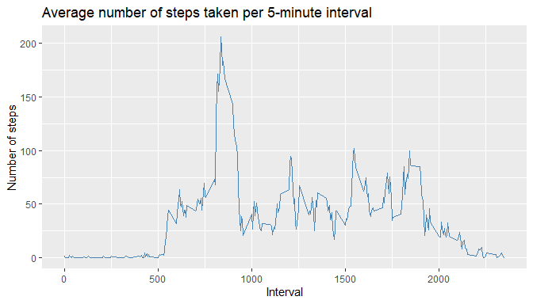

## Introduction

It is now possible to collect a large amount of data about personal movement using activity monitoring devices such as a [Fitbit](https://www.fitbit.com/), [Nike Fuelband](https://www.nike.com/help/a/why-cant-i-sync), or [Jawbone Up](https://jawbone.com/up). These type of devices are part of the “quantified self” movement – a group of enthusiasts who take measurements about themselves regularly to improve their health, to find patterns in their behaviour, or because they are tech geeks. But these data remain under-utilized both because the raw data are hard to obtain and there is a lack of statistical methods and software for processing and interpreting the data.

This assignment makes use of data from a personal activity monitoring device. This device collects data at 5 minute intervals through out the day. The data consists of two months of data from an anonymous individual collected during the months of October and November, 2012 and include the number of steps taken in 5 minute intervals each day.

The variables included in this dataset are:

-	steps: Number of steps taking in a 5-minute interval (missing values are coded as NA)
-	date: The date on which the measurement was taken in YYYY-MM-DD format
-	interval: Identifier for the 5-minute interval in which measurement was taken

The dataset is stored in a comma-separated-value (CSV) file and there are a total of 17,568 observations in this dataset.

## Assignment

Set the path and load the necessary packages:

```r
setwd("C:/Users/user/datasciencecoursera/RepData_PeerAssessment1")
library(dplyr)
```

```
## 
## Attaching package: 'dplyr'
```

```
## The following objects are masked from 'package:stats':
## 
##     filter, lag
```

```
## The following objects are masked from 'package:base':
## 
##     intersect, setdiff, setequal, union
```

```r
library(ggplot2)
```

Check if the (zipped) data folder has already been downloaded. If not, download:

```r
filename <- "activity.zip"

if (!file.exists(filename)){
  fileURL <- "https://d396qusza40orc.cloudfront.net/repdata%2Fdata%2Factivity.zip"
  download.file(fileURL, filename, method="curl")
}  
```

Check if the (zipped) folder has already been unzipped. If not, unzip:

```r
if (!file.exists("activity")) { 
  unzip(filename) 
}
```

### 1. Load the data and (if needed) transform into a suitable format for the analysis:

```r
data <- read.csv("activity.csv", header = TRUE)
```

Total number of steps taken each day:

```r
datadaily <- data %>% group_by(date) %>% summarise(sum(steps))
names(datadaily)[2] <- "Total steps"
```

### 2. Histogram of the total number of steps taken each day:

```r
hist(datadaily$`Total steps`, main="Total number of steps taken each day", xlab="Steps per day", ylab="Frequency", col="darkmagenta")
```

<!-- -->

### 3. Mean and median number of steps taken each day:

Mean number of steps per day:

```r
meanstep <- mean(datadaily$`Total steps`, na.rm = TRUE)
print(meanstep)
```

```
## [1] 10766.19
```

Median number of steps per day:

```r
medianstep <- median(datadaily$`Total steps`, na.rm = TRUE)
print(medianstep)
```

```
## [1] 10765
```

### 4. Time series plot of the average number of steps taken:


```r
avgstepsgrouped1 <- data %>% group_by(interval) %>% summarise(mean(steps, na.rm = TRUE))
names(avgstepsgrouped1)[2] <- "Average steps"
```

Plot the average number of steps:

```r
g <- ggplot(avgstepsgrouped1, aes(avgstepsgrouped1$interval, avgstepsgrouped1$`Average steps`))
g + geom_line(col="steelblue", na.rm = TRUE) + labs(title = "Average number of steps taken per 5-minute interval") + labs(x = "Interval") + labs(y = "Number of steps")
```

<!-- -->

### 5. The 5-minute interval that, on average, contains the maximum number of steps:

```r
maxstep <- max(avgstepsgrouped1$`Average steps`)
intervalmaxwithdate <- avgstepsgrouped1[which(avgstepsgrouped1$`Average steps` == maxstep),1:2]
print(intervalmaxwithdate)
```

```
## # A tibble: 1 x 2
##   interval `Average steps`
##      <int>           <dbl>
## 1      835            206.
```

Calculate and report the total number of missing values in the dataset (i.e. the total number of rows with NAs)

```r
sum(is.na(data$steps))
```

```
## [1] 2304
```

### 6. Code to describe and show a strategy for imputing missing data: 

Here we will create a new dataset that is equal to the original dataset but with the missing data filled in.


```r
rownr <- dim(data)[1]
datena <- as.data.frame(data$date)
names(datena)[1] <- "datena"        ## dates with NAs
dataimputed <- data
```

Mean number of steps per day:

```r
meansteps <- data %>% group_by(date) %>% summarise(mean(steps))
names(meansteps)[2] <- "Average mean steps"
```

Missing values are filled with meansteps values. If meansteps value is also missing, then, they are filled with the mean of meansteps:

```r
for (i in 1:rownr){
  if (is.na(data[i, 1]) == TRUE & is.na(meansteps[which(meansteps$date == datena[i,1]),2]) == TRUE){
      dataimputed[i, 1] <- mean(meansteps$`Average mean steps`, na.rm=TRUE)
  } else if (is.na(data[i, 1]) == TRUE & is.na(meansteps[which(meansteps$date == datena[i,1]),2]) == FALSE){
    dataimputed[i, 1] <- meansteps[which(meansteps$date == datena[i,1]),2]
  } else if (is.na(data[i, 1]) == FALSE){
  dataimputed[i, 1] <- data[i,1]
  }
} 
```

### 7. Histogram of the total number of steps taken each day after missing values are imputed:

```r
datadailyimputed <- dataimputed %>% group_by(date) %>% summarise(sum(steps))
names(datadailyimputed)[2] <- "Total steps"
```


```r
hist(datadailyimputed$`Total steps`, main="Total number of steps taken each day", xlab="Steps per day", ylab="Frequency", col="darkmagenta")
```

<!-- -->

Mean total number of steps taken per day: 

```r
meanstepimputed <- mean(datadailyimputed$`Total steps`, na.rm = TRUE)
print(meanstepimputed)
```

```
## [1] 10766.19
```

Median total number of steps taken per day: 

```r
medianstepimputed <- median(datadailyimputed$`Total steps`, na.rm = TRUE)
print(medianstepimputed)
```

```
## [1] 10766.19
```

These values differ from the estimates from the first part of the assignment. The estimates of the total daily number of steps are now higher as we've now inserted positive values in place of the NA values, which were converted to 0's while calculating the mean and the median.

### 8. Panel plot comparing the average number of steps taken per 5-minute interval across weekdays and weekends:

Create a new factor variable in the dataset with two levels – “weekday” and “weekend” indicating whether a given date is a weekday or weekend day:

```r
dataimputed$day <- weekdays(as.Date(dataimputed$date))
for (i in 1:rownr) {
  if (dataimputed[i,4] %in% c("Saturday","Sunday")){
    dataimputed$dayofweek[i] <- "weekend"
  } else if (dataimputed[i,4] %in% c("Monday","Tuesday", "Wednesday", "Thursday", "Friday")) {
    dataimputed$dayofweek[i] <- "weekday"
  }
}
 
avgstepsgrouped <- dataimputed %>% group_by(interval, dayofweek) %>% summarise(mean(steps))
names(avgstepsgrouped)[3] <- "Average steps"
```

Generate the plot:

```r
g <- ggplot(avgstepsgrouped, aes(avgstepsgrouped$interval, avgstepsgrouped$`Average steps`))
g + geom_line(col="steelblue") + facet_grid(. ~ avgstepsgrouped$dayofweek) + labs(title = "Average number of steps taken per 5-minute interval") + labs(x = "Interval") + labs(y = "Number of steps")
```

<!-- -->

Activity patterns in weekdays seem to be different from those in weekends.
